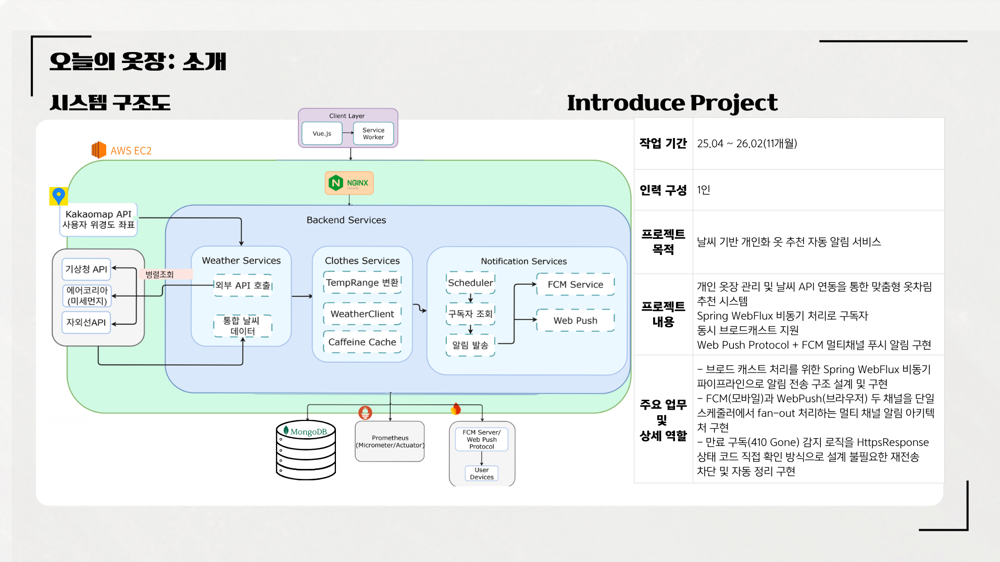

## 오늘의 옷장 (WishWardrobe)

> WebFlux 비동기 처리 기반 푸시 알림 시스템  
> 개인 프로젝트 | 2025.04 – 2026.04(12개월)

---

## 기술 스택
Java, Spring WebFlux,Oracle, MongoDB,AWS EC2,Fcm, Web Push API,Docker, GitHub,Vue.js

---

## 핵심 구현: FCM/WebPush 비동기 알림 발송

**배경**
사용자 환경에 따라 알림 채널을 분기:
- 모바일 앱 → FCM
- 웹 브라우저 → WebPush
각 채널을 독립 Mono로 구성해 한쪽 실패가 다른 채널에 영향을 주지 않도록 설계

동기 처리 시 두 가지 문제 확인:
- Firebase SDK .get() 블로킹 호출이 비정상 토큰에서 무한 대기
  → 스레드 점유로 정상 요청까지 차단되는 스레드 풀 고갈 발생
- WebPush 라이브러리 블로킹 I/O로 건당 최대 82초 지연
  → 만료 구독(410 Gone) 미감지로 불필요한 재전송 반복

**해결**

FCM:
- ApiFutures로 Future → Mono 타입 통합
- reactor cancel 신호가 에러 경로로 정상 전파되도록 재설계
- 개별 응답 측정값(67~88ms) 기준 5초 타임아웃 설정

WebPush:
- AsyncHttpClient 비동기 전환 후 Mono.fromFuture()로 WebFlux 파이프라인 연결
- HttpResponse.statusCode() 직접 확인으로 410 Gone 즉시 감지 → 만료 구독 즉시 삭제

**검증**
Fake 토큰 100개 → 1,000개로 부하 확장 테스트:
- 비정상 토큰 유입 시에도 정상 요청 처리되는 장애 격리 구조 확인
- 만료 구독 재전송 차단 확인
---

## 외부 API 연동

**기상청 단기예보 API + 카카오 위치 API**

카카오 API에서 수신한 사용자 현재 위치(위경도)를
기상청 요구 형식인 격자 좌표(nx, ny)로 변환 후 날씨 조회

- 흐름:
카카오 현재위치(위경도) → 격자 좌표 변환 → 기상청 단기예보 API → 날씨 데이터 반환

검증:
서울시청, 강남역, 부산, 인천공항, 제주 5개 지점

위경도 → 격자 좌표 변환 정확도 Postman으로 확인

---

